# 🏎️ Car Price Predictor

<p align="center">
  
</p>

<p align="center">

  
</p>

<br/>

<p align="center">

  <a href="https://www.python.org/"></a>
  <a href="https://flask.palletsprojects.com/"></a>
  <a href="https://scikit-learn.org/"></a>
  <a href="https://pandas.pydata.org/"></a>
  <a href="https://numpy.org/"></a>
  <a href="./LICENSE"></a>
</p>

<p align="center">
  
  
  
</p>

---

<br/>

## 🧭 Table of Contents

<p align="center">

| 🔗 Section                                  | Description                   |
| :------------------------------------------ | :---------------------------- |
| [✨ Overview](#-overview)                   | What this project does        |
| [🌐 Web Application](#-web-application)    | The prediction web interface  |
| [🏗️ Architecture](#️-architecture)           | How the pipeline works        |
| [📊 Features Used](#-features-used)         | Feature engineering details   |
| [🤖 Model](#-model)                         | Random Forest details         |
| [📈 Results](#-results)                     | Model performance             |
| [🚀 Quick Start](#-quick-start)             | Get running in 60 seconds     |
| [📁 Project Structure](#-project-structure) | Repository layout             |
| [🛠️ Tech Stack](#️-tech-stack)               | Technologies used             |
| [🤝 Contributing](#-contributing)           | How to contribute             |
| [📜 License](#-license)                     | Apache 2.0                    |

</p>

<br/>

---

## ✨ Overview

> **Predict the current market price of any used car** using an AI-powered web application built with Flask and Random Forest ML — trained on **15,000+ real market listings** from CarDekho. 🏆

This is a **full-stack machine learning web application** where users can:

1. 🌐 Open the web interface in their browser
2. 📝 Enter car details (age, mileage, engine, fuel type, etc.)
3. 🤖 Get an instant AI-powered price prediction
4. 💰 See the estimated market value displayed beautifully

```text
📥 Load Data → 🧹 Clean → 🔧 Feature Engineer → 🎯 Train → 💾 Save Model → 🌐 Serve via Flask → 💰 Predict
```

<br/>

---

## 🌐 Web Application

The project includes a **premium, professional web interface** built with HTML, CSS, and JavaScript, served by a Flask backend.

### ✨ Key Features

- 🎨 **Modern Dark Theme** with glassmorphism and gradient accents
- ⚡ **Instant Predictions** — results appear in under 1 second
- 📱 **Fully Responsive** — works on desktop, tablet, and mobile
- 🔄 **Dynamic Form** — dropdowns and hints auto-populated from model metadata
- 📊 **Model Stats Dashboard** — live R², MAE, and RMSE metrics displayed
- ✨ **Micro-Animations** — smooth transitions, scroll effects, and hover states

### 🖥️ How to Use

1. Start the Flask server (see [Quick Start](#-quick-start))
2. Open `http://localhost:5000` in your browser
3. Fill in the car details form
4. Click **"Predict Price"**
5. View the estimated market price instantly!

<br/>

---

## 🏗️ Architecture

```mermaid
flowchart LR
    A["📥 Raw CSV\n(car_data.csv)"] --> B["🧹 Data Cleaning\nDrop nulls & irrelevant cols"]
    B --> C["🔧 Feature Engineering\n6 numeric + 3 categorical"]
    C --> D["🔢 One-Hot Encoding\nCategorical → binary flags"]
    D --> E["✂️ Train/Test Split\n80% / 20%"]
    E --> F["🌲 Random Forest\n100 trees"]
    F --> G["💾 Save Model\nmodel.pkl + metadata"]
    G --> H["🌐 Flask Web App\nServe predictions via API"]
    H --> I["💰 User Gets\nPredicted Price"]
```



<br/>

---

## 📊 Features Used

The model uses **9 features** (6 numerical + 3 categorical) to predict the `selling_price`:

<details>
<summary><b>🔢 Numerical Features (6)</b> — Click to expand</summary>

<br/>

|  #  | Feature       | Description              | Impact                           |
| :-: | :------------ | :----------------------- | :------------------------------- |
|  1  | `vehicle_age` | Age of the car in years  | 📉 Older → lower price           |
|  2  | `km_driven`   | Total kilometers driven  | 📉 Higher mileage → lower price  |
|  3  | `mileage`     | Fuel efficiency (km/l)   | 📈 Better mileage → higher value |
|  4  | `engine`      | Engine displacement (cc) | 📈 Larger engine → higher price  |
|  5  | `max_power`   | Peak horsepower (bhp)    | 📈 More power → higher price     |
|  6  | `seats`       | Seating capacity         | ↔️ Depends on car segment        |

</details>

<details>
<summary><b>🏷️ Categorical Features (3)</b> — Click to expand</summary>

<br/>

|  #  | Feature             | Categories                             | Encoding |
| :-: | :------------------ | :------------------------------------- | :------- |
|  1  | `fuel_type`         | Petrol · Diesel · CNG · LPG · Electric | One-Hot  |
|  2  | `transmission_type` | Manual · Automatic                     | One-Hot  |
|  3  | `seller_type`       | Individual · Dealer · Trustmark Dealer | One-Hot  |

</details>

<br/>

---

## 🤖 Model

> The project uses a **Random Forest Regressor** — an ensemble of 100 decision trees that was selected as the best-performing model.

```python
RandomForestRegressor(
    n_estimators=100,
    max_depth=15,
    min_samples_split=5,
    min_samples_leaf=2,
    n_jobs=-1  # All CPU cores
)
```

**Why Random Forest?**

- ✅ Captures non-linear relationships between features and price
- ✅ Robust to outliers in the dataset
- ✅ Built-in feature importance ranking
- ✅ Achieves **92.65% R² accuracy** on test data

<details>
<summary><b>🌲 Feature Importance Analysis</b> — Click to reveal</summary>

<br/>

The Random Forest reveals which features matter most for pricing:

```text
  Rank   Feature                          Importance
  ──────────────────────────────────────────────────
   1.    vehicle_age                      ████████████████████  High
   2.    max_power                        ███████████████████   High
   3.    engine                           ████████████████      High
   4.    km_driven                        ██████████            Medium
   5.    mileage                          ████████              Medium
   6.    seats                            ████                  Low
   7.    transmission_type_Manual         ███                   Low
   8.    fuel_type_Petrol                 ██                    Low
   9.    seller_type_Individual           █                     Low
```

> **Key Insight:** `vehicle_age` and `max_power` are the two most important predictors — together they explain a large portion of the price variance.

</details>

<br/>

---

## 📈 Results

> 🏆 **Random Forest** achieves **92.65% R² accuracy** on the test set!

| Metric                       | Value         |
| :--------------------------- | :-----------: |
| **R² Score**                 | 0.9265        |
| **R² Percentage**            | 92.65%        |
| **Mean Absolute Error (MAE)**| Rs. 1,05,225  |
| **Root Mean Sq Error (RMSE)**| Rs. 2,35,293  |
| **Training Samples**         | 12,328        |
| **Testing Samples**          | 3,083         |
| **Decision Trees**           | 100           |

<br/>

---

## 🚀 Quick Start


Get the project running in **60 seconds** ⏱️

### Prerequisites

- 🐍 Python **3.10+**
- 📦 pip (Python package manager)

### Installation

```bash
# 1️⃣ Clone the repository
git clone https://github.com/algorithnicmind/Car-predict.git
cd Car-predict

# 2️⃣ Create a virtual environment (recommended)
python -m venv .venv

# 3️⃣ Activate it
# Windows:
.venv\Scripts\activate
# macOS/Linux:
source .venv/bin/activate

# 4️⃣ Install dependencies
pip install -r requirements.txt
```

### Train the Model

```bash
# 🧠 Train the Random Forest model (saves model.pkl + model_metadata.json)
python train_model.py
```

### Launch the Web App

```bash
# 🌐 Start the Flask web server
python app.py

# Open http://localhost:5000 in your browser 🎉
```

### Run the CLI Comparison (Optional)

```bash
# 📊 Run the original model comparison script
python predict_model.py
```

<br/>

---

## 📁 Project Structure

```text
Car-predict/
│
├── 🌐 app.py                  # Flask web application (backend)
├── 🧠 train_model.py          # Model training & saving script
├── 📊 predict_model.py        # CLI model comparison (LR vs RF)
├── 📊 car_data.csv            # CarDekho used car dataset (~15K records)
├── 🤖 model.pkl               # Trained Random Forest model
├── 📋 model_metadata.json     # Feature metadata for the frontend
├── 📋 requirements.txt        # Python dependencies
├── 📜 LICENSE                  # Apache License 2.0
├── 📖 README.md                # You are here! ✨
│
├── 📁 templates/
│   └── index.html             # Main HTML frontend page
│
└── 📁 static/
    ├── 📁 css/
    │   └── style.css          # Premium dark-theme stylesheet
    └── 📁 js/
        └── app.js             # Frontend JavaScript logic
```

<br/>

---

## 🛠️ Tech Stack


<p align="center">
  
</p>

| Technology          | Role                     | Version |
| :------------------ | :----------------------- | :------ |
| 🐍 **Python**       | Core language            | 3.10+   |
| 🌐 **Flask**        | Web framework (backend)  | 3.x     |
| 🧠 **Scikit-Learn** | ML model & metrics       | Latest  |
| 🐼 **Pandas**       | Data manipulation        | Latest  |
| 🔢 **NumPy**        | Numerical computing      | Latest  |
| 💾 **Joblib**       | Model serialization      | Latest  |
| 🎨 **HTML/CSS/JS**  | Frontend interface       | —       |
| 📂 **Git / GitHub** | Version control          | —       |

<br/>

---

## 🗺️ Roadmap

- [x] 🧹 Data cleaning pipeline
- [x] 📐 Linear Regression model
- [x] 🌲 Random Forest model (92.65% accuracy)
- [x] 📊 Head-to-head model comparison (CLI)
- [x] 🌲 Feature importance analysis
- [x] 🔮 Single car prediction example
- [x] 💾 Save trained model with joblib
- [x] 🌐 Build a Flask web UI with professional design
- [x] 🔗 Connect frontend ↔ backend via REST API
- [ ] 📈 Add data visualizations (matplotlib / seaborn)
- [ ] 🧪 Add XGBoost / Gradient Boosting models
- [ ] 🐳 Dockerize the project
- [ ] 🚀 Deploy to cloud (Render / Railway / AWS)

---

## 🤝 Contributing

Contributions are welcome! Here's how you can help:

```bash
1. 🍴 Fork this repository
2. 🌿 Create a feature branch    →  git checkout -b feature/amazing-feature
3. 💾 Commit your changes        →  git commit -m "Add amazing feature"
4. 🚀 Push to the branch         →  git push origin feature/amazing-feature
5. 🔃 Open a Pull Request
```

<details>

<summary><b>💡 Ideas for Contributions</b></summary>

<br/>

- 📊 Add data visualization charts (price distributions, correlation heatmaps)
- 🧪 Implement additional ML models (XGBoost, LightGBM, Neural Networks)
- 🐳 Create a Dockerfile for containerization
- 📝 Add unit tests and CI/CD pipeline
- 🚀 Deploy to a cloud platform
- 📚 Expand documentation with Jupyter notebooks

</details>

---

## 📜 License

This project is licensed under the **Apache License 2.0** — see the [`LICENSE`](./LICENSE) file for details.

```text
Copyright 2025 algorithnicmind

Licensed under the Apache License, Version 2.0
You may not use this file except in compliance with the License.
```

---

<p align="center">
  
</p>

<p align="center">
  <a href="https://github.com/algorithnicmind"></a>
</p>

<p align="center">
  ⭐ If you found this project helpful, give it a star! ⭐
</p>
