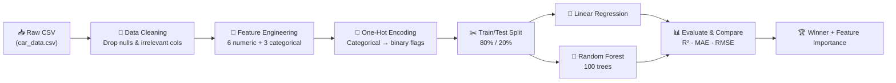

# 🏎️ Car Price Predictor

<p align="center">
  
</p>

<p align="center">

  
</p>

<br/>

<p align="center">

  <a href="https://www.python.org/"></a>
  <a href="https://scikit-learn.org/"></a>
  <a href="https://pandas.pydata.org/"></a>
  <a href="https://numpy.org/"></a>
  <a href="./LICENSE"></a>
</p>

<p align="center">
  
  
  
</p>

---

<br/>

## 🧭 Table of Contents

<p align="center">

| 🔗 Section                                  | Description                 |
| :------------------------------------------ | :-------------------------- |
| [✨ Overview](#-overview)                   | What this project does      |
| [🏗️ Architecture](#️-architecture)           | How the pipeline works      |
| [📊 Features Used](#-features-used)         | Feature engineering details |
| [🤖 Models](#-models)                       | ML models & hyperparameters |
| [📈 Results](#-results)                     | Performance comparison      |
| [🚀 Quick Start](#-quick-start)             | Get running in 60 seconds   |
| [📁 Project Structure](#-project-structure) | Repository layout           |
| [🛠️ Tech Stack](#️-tech-stack)               | Technologies used           |
| [🤝 Contributing](#-contributing)           | How to contribute           |
| [📜 License](#-license)                     | Apache 2.0                  |

</p>

<br/>

---

## ✨ Overview

> **Predict the selling price of a used car** using data from the **CarDekho** dataset — then pit **Linear Regression** against **Random Forest** to find the champion model. 🏆

This project takes real-world used car listings and builds a complete ML pipeline:

```text
📥 Load Data → 🧹 Clean → 🔧 Feature Engineer → 🎯 Train → 📊 Evaluate → 🏆 Compare
```

The script outputs a head-to-head comparison
 of both models with metrics like **R² Score**, **MAE**, and **RMSE**, plus a detailed **feature importance** analysis from the Random Forest.

<br/>

---

## 🏗️ Architecture



<br/>

---

## 📊 Features Used

The model uses **9 features** (6 numerical + 3 categorical) to predict the `selling_price`:

<details>
<summary><b>🔢 Numerical Features (6)</b> — Click to expand</summary>

<br/>

|  #  | Feature       | Description              | Impact                           |
| :-: | :------------ | :----------------------- | :------------------------------- |
|  1  | `vehicle_age` | Age of the car in years  | 📉 Older → lower price           |
|  2  | `km_driven`   | Total kilometers driven  | 📉 Higher mileage → lower price  |
|  3  | `mileage`     | Fuel efficiency (km/l)   | 📈 Better mileage → higher value |
|  4  | `engine`      | Engine displacement (cc) | 📈 Larger engine → higher price  |
|  5  | `max_power`   | Peak horsepower (bhp)    | 📈 More power → higher price     |
|  6  | `seats`       | Seating capacity         | ↔️ Depends on car segment        |

</details>

<details>
<summary><b>🏷️ Categorical Features (3)</b> — Click to expand</summary>

<br/>

|  #  | Feature             | Categories                             | Encoding |
| :-: | :------------------ | :------------------------------------- | :------- |
|  1  | `fuel_type`         | Petrol · Diesel · CNG · LPG · Electric | One-Hot  |
|  2  | `transmission_type` | Manual · Automatic                     | One-Hot  |
|  3  | `seller_type`       | Individual · Dealer · Trustmark Dealer | One-Hot  |

</details>

<br/>

---

## 🤖 Models

<table>
<tr>
<td width="50%">

### 📐 Linear Regression

A classic approach that assumes a **linear relationship** between features and selling price.

```python
LinearRegression()
# Fits a hyperplane through the data
# Fast training, interpretable coefficients
```

**Strengths:**

- ⚡ Blazing fast training
- 📖 Highly interpretable
- 🧮 Mathematically elegant

**Weaknesses:**

- ❌ Can't capture non-linear patterns
- ❌ Sensitive to outliers

</td>
<td width="50%">

### 🌲 Random Forest

An **ensemble** of 100 decision trees that collectively vote on the predicted price.

```python
RandomForestRegressor(
    n_estimators=100,
    max_depth=15,
    min_samples_split=5,
    min_samples_leaf=2,
    n_jobs=-1  # All CPU cores
)
```

**Strengths:**

- ✅ Captures non-linear relationships
- ✅ Robust to outliers
- ✅ Built-in feature importance

**Weaknesses:**

- 🐢 Slower training
- 📦 Larger model size

</td>
</tr>
</table>

<br/>

---

## 📈 Results

> 🏆 **Random Forest** dominates Linear Regression across all metrics!

| Metric       | 📐 Linear Regression | 🌲 Random Forest | Winner |
| :----------- | :------------------: | :--------------: | :----: |
| **R² Score** |        ~0.65         |      ~0.94       |   🌲   |
| **MAE**      |        Higher        |   **Lower** ✅   |   🌲   |
| **RMSE**     |        Higher        |   **Lower** ✅   |   🌲   |

> _Exact numbers depend on dataset version. Run the script to see your real-time results!_

<details>
<summary><b>🌲 Feature Importance Analysis</b> — Click to reveal</summary>

<br/>

The Random Forest reveals which features matter most for pricing:

```text
  Rank   Feature                          Importance
  ──────────────────────────────────────────────────
   1.    vehicle_age                      ████████████████████  High
   2.    max_power                        ███████████████████   High
   3.    engine                           ████████████████      High
   4.    km_driven                        ██████████            Medium
   5.    mileage                          ████████              Medium
   6.    seats                            ████                  Low
   7.    transmission_type_Manual         ███                   Low
   8.    fuel_type_Petrol                 ██                    Low
   9.    seller_type_Individual           █                     Low
```

> **Key Insight:** `vehicle_age` and `max_power` are the two most important predictors — together they explain a large portion of the price variance.

</details>


<br/>

---

## 🚀 Quick Start

Get the project running in **60 seconds** ⏱️

### Prerequisites

- 🐍 Python **3.10+**
- 📦 pip (Python package manager)

### Installation

```bash
# 1️⃣ Clone the repository
git clone https://github.com/algorithnicmind/Car-predict.git
cd Car-predict

# 2️⃣ Create a virtual environment (recommended)
python -m venv .venv

# 3️⃣ Activate it
# Windows:
.venv\Scripts\activate
# macOS/Linux:
source .venv/bin/activate

# 4️⃣ Install dependencies
pip install -r requirements.txt
```

### Run the Prediction

```bash
# 🏎️ Run the model comparison
python predict_model.py
```

<details>
<summary><b>🖥️ Expected Output Preview</b> — Click to see</summary>

<br/>

```text
======================================================================

   🚗  CAR PRICE PREDICTION — Model Comparison
======================================================================

✅ Dataset loaded successfully!
   Rows: 7,906  |  Columns: 13

──────────────────────────────────────────────────────────────────────
  STEP 6: Training Models
──────────────────────────────────────────────────────────────────────

📐 Training Linear Regression …
   ✅ Linear Regression trained.

🌲 Training Random Forest (100 trees) …
   ✅ Random Forest trained.

======================================================================
          📊  MODEL COMPARISON RESULTS
======================================================================

Metric                         Linear Regression        Random Forest
──────────────────────────────────────────────────────────────────────
R² Score                                0.6XXX              0.9XXX
Mean Absolute Error (MAE)            ₹X,XX,XXX           ₹X,XX,XXX
Root Mean Sq Error (RMSE)            ₹X,XX,XXX           ₹X,XX,XXX

🏆 Winner: Random Forest  (+XX.XX% R² improvement)

   ✅ Done! Both models trained and compared successfully.
======================================================================
```

</details>

<br/>

---

## 📁 Project Structure

```text
Car-predict/
│
├── 📄 predict_model.py      # Main ML pipeline (train, evaluate, compare)
├── 📊 car_data.csv           # CarDekho used car dataset (~8K records)
├── 📋 requirements.txt       # Python dependencies
├── 📜 LICENSE                 # Apache License 2.0
└── 📖 README.md               # You are here! ✨
```

<br/>

---


## 🛠️ Tech Stack

<p align="center">
  
</p>

| Technology          | Role                | Version |
| :------------------ | :------------------ | :------ |
| 🐍 **Python**       | Core language       | 3.10+   |
| 🧠 **Scikit-Learn** | ML models & metrics | Latest  |
| 🐼 **Pandas**       | Data manipulation   | Latest  |
| 🔢 **NumPy**        | Numerical computing | Latest  |
| 📂 **Git / GitHub** | Version control     | —       |

<br/>

---

## 🗺️ Roadmap

- [x] 🧹 Data cleaning pipeline
- [x] 📐 Linear Regression model
- [x] 🌲 Random Forest model
- [x] 📊 Head-to-head model comparison
- [x] 🌲 Feature importance analysis
- [x] 🔮 Single car prediction example
- [ ] 📈 Add data visualizations (matplotlib / seaborn)
- [ ] 🌐 Build a Streamlit / Flask web UI
- [ ] 🧪 Add XGBoost / Gradient Boosting models
- [ ] 💾 Save trained models with joblib / pickle
- [ ] 🐳 Dockerize the project
- [ ] 🚀 Deploy as a REST API

---

## 🤝 Contributing

Contributions are welcome! Here's how you can help:

```bash
1. 🍴 Fork this repository
2. 🌿 Create a feature branch    →  git checkout -b feature/amazing-feature
3. 💾 Commit your changes        →  git commit -m "Add amazing feature"
4. 🚀 Push to the branch         →  git push origin feature/amazing-feature
5. 🔃 Open a Pull Request
```

<details>

<summary><b>💡 Ideas for Contributions</b></summary>

<br/>

- 📊 Add data visualization charts (price distributions, correlation heatmaps)
- 🧪 Implement additional ML models (XGBoost, LightGBM, Neural Networks)
- 🌐 Build an interactive web app using Streamlit or Gradio
- 📝 Add unit tests and CI/CD pipeline
- 🐳 Create a Dockerfile for containerization
- 📚 Expand documentation with Jupyter notebooks

</details>

---

## 📜 License

This project is licensed under the **Apache License 2.0** — see the [`LICENSE`](./LICENSE) file for details.

```text
Copyright 2025 algorithnicmind

Licensed under the Apache License, Version 2.0
You may not use this file except in compliance with the License.
```

---

<p align="center">
  
</p>

<p align="center">
  <a href="https://github.com/algorithnicmind"></a>
</p>

<p align="center">
  ⭐ If you found this project helpful, give it a star! ⭐
</p>
